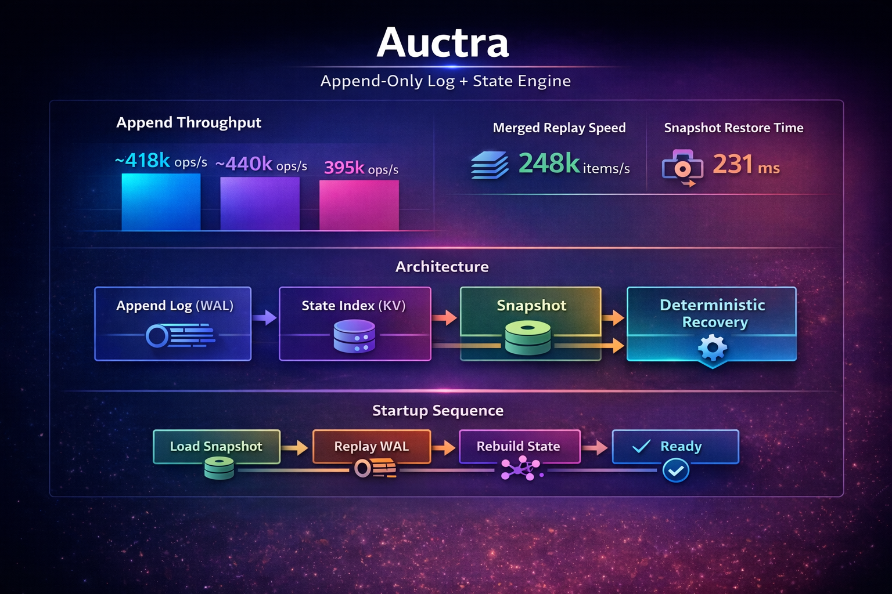

<h3 align="center">
⚡ Append-only log + real-time state in a single engine
</h3>

  
  
  

---

## What is Auctra?

**Auctra is an append-only log + state engine.**

It sits between log systems and databases, combining:

- a write-ahead log (WAL)
- a queryable key-value state
- snapshots and checkpoints
- deterministic replay

Instead of stitching together multiple systems, Auctra gives you:

> **history + state in one engine**

---

## The Problem

Modern systems almost always need both:

- full event history
- fast current state

But today you typically combine:

- Kafka / logs → for history
- databases → for state
- caches → for performance
- pipelines → for replay

This creates:

- complex architectures
- multiple failure modes
- duplicated data paths
- hard-to-debug systems

---

## The Auctra Approach

append-only log + current state

Every write is:

1. appended to a log  
2. reflected in current state  
3. available for replay  

No dual systems. No sync problems. No divergence.

---

## What You Can Build

- event sourcing systems
- financial ledgers
- audit trails
- real-time state + history pipelines
- embedded stream processors
- deterministic replay systems

---

## Core Concepts

### Single Write Path

All writes go through one path:

write → WAL → state → replay

This guarantees:

- consistency
- determinism
- traceability

---

### Write Lifecycle

Auctra distinguishes three stages:

1. append → written to WAL  
2. commit → visible to reads  
3. sync → durable  

---

### Write States

| State    | Meaning                                        |
| -------- | ---------------------------------------------- |
| Appended | The write was appended to the WAL              |
| Visible  | The write is visible to reads                  |
| Durable  | The write is expected to survive crash/restart |

---

### Durability Modes

| Mode      | Visibility   | Durability            |
| --------- | ------------ | --------------------- |
| ultrafast | after commit | later                 |
| batch     | after commit | batched sync          |
| strict    | after commit | ensured before return |

---

## High-Level API

putWithDurability(...)
putVisible(...)
commit()
sync()

---

## Example

./auctra-core put user:1 Alice
./auctra-core get user:1

---

## Benchmark

Run:

./zig-out/bin/bench

### Append throughput

ultrafast: ~418k ops/sec  
batch:     ~440k ops/sec  
strict:    ~390k ops/sec  

### Replay

merged replay: ~244k items/sec  

### Snapshot

save (100k entries):    ~1.7 s  
restore (100k entries): ~230 ms  

---

### Notes

- single-node measurements  
- no networking or replication  
- depends on hardware  

Designed for:

- high write throughput  
- fast recovery  
- efficient replay  

---

## 🧪 Auctra Server (Preview)

Run:

./auctra-core server

### Supported operations

- PING
- APPEND
- GET

---

## Architecture

docs/architecture.md

---

## Status

Developer Preview

---

## License

MIT
